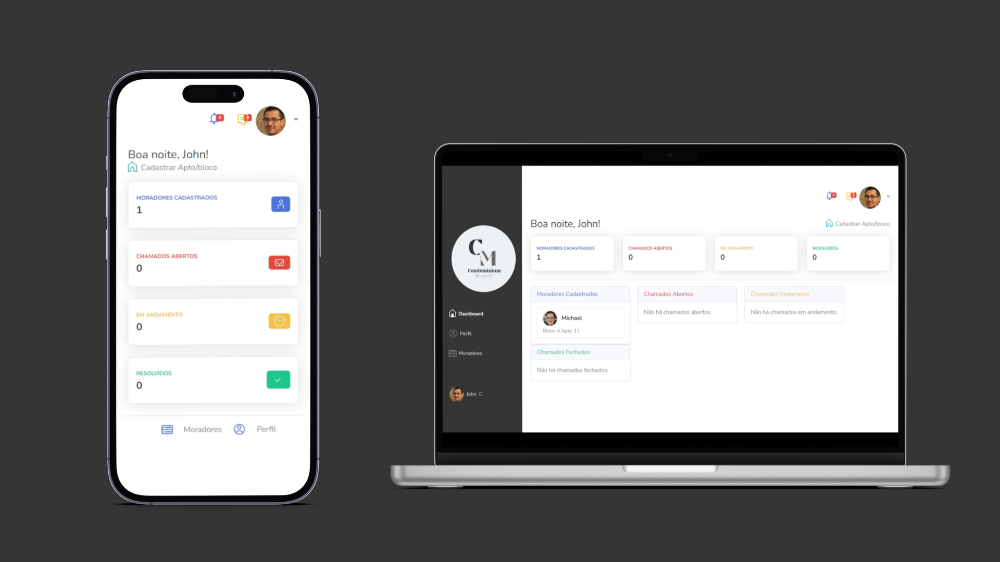

<h1 align="center"> <b>Condominium Management</b> </h1>

Projeto de Gestão condominial desenvolvido para Facilitar a Comunicação e Gerenciamento do condominio.  

  <a href="#-tecnologias">Tecnologias</a>&nbsp;&nbsp;&nbsp;|&nbsp;&nbsp;&nbsp;
  <a href="#-projeto">Projeto</a>&nbsp;&nbsp;&nbsp;|&nbsp;&nbsp;&nbsp;
  <a href="#-layout">Layout</a>
 

 

  

## 🚀 Tecnologias

Esse projeto foi desenvolvido com as seguintes tecnologias:

- JavaScript
- PHP
- Bootstrap
- Banco de Dados MySQL
- Git e Github

## 💻 Projeto

- [Projeto Finalizado](http://managementcond.rf.gd/index.php)
- 
- [Documentação](http://managementcond.rf.gd/index.php) 📖

--

Feito com ♥ by Gabriel
